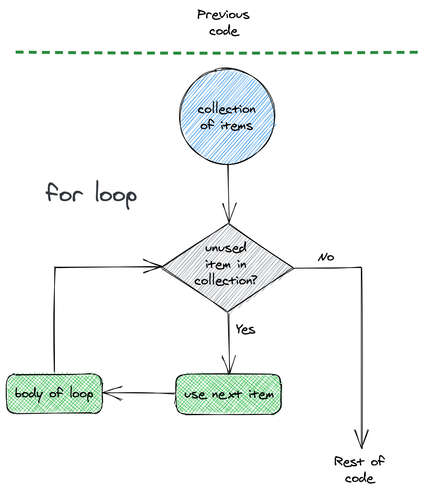
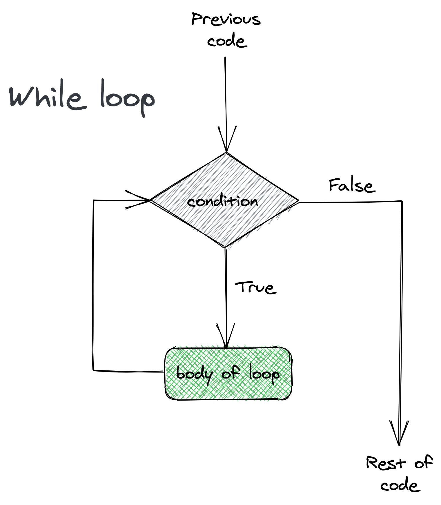
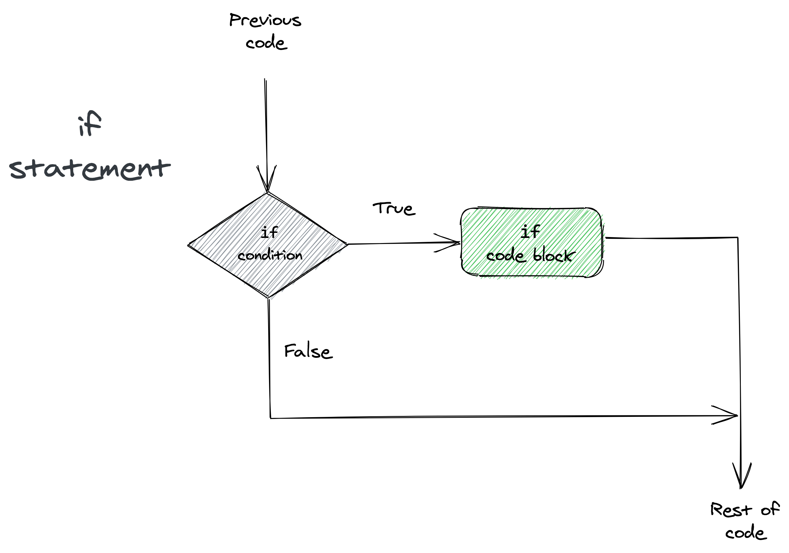
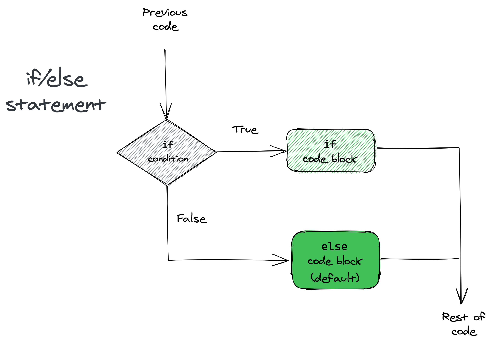
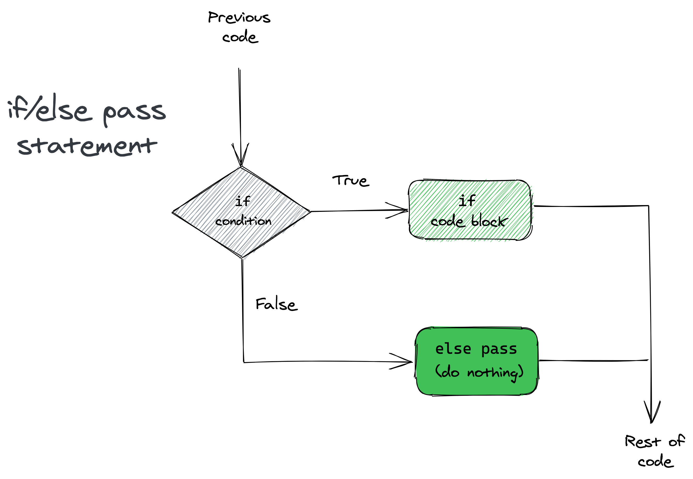
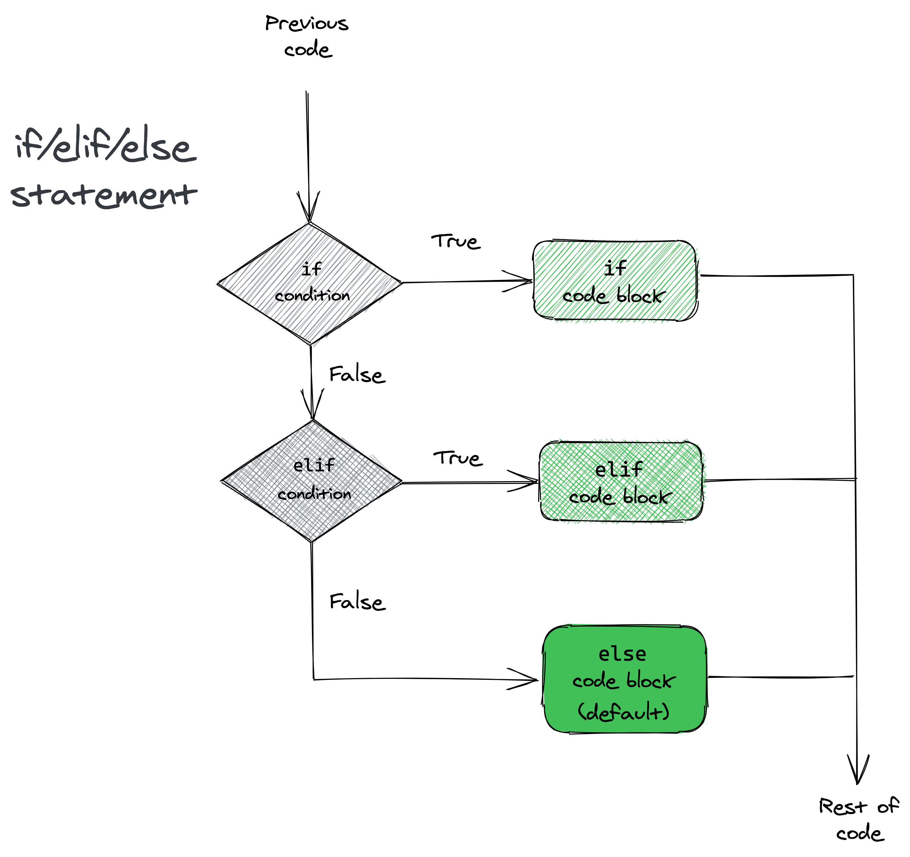
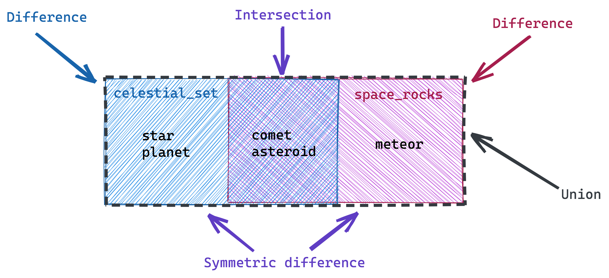
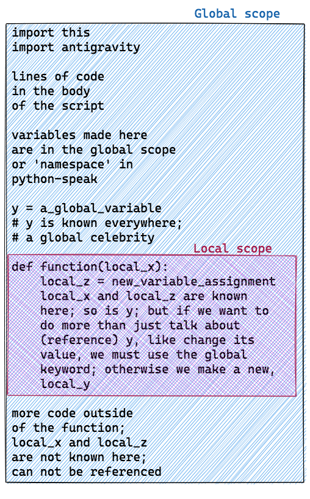

# Programming-diagrams

This is a collection of programming diagrams that may be used for teaching. While they may be similar to many languages, the specific implementations shown reflect how these programming constructs work in Python. If using with relation to another language, please check that the diagram matches the implementation.

The diagrams can be previewed below. To obtain the files, navigate to the `static` directory, for fixed images, or to the `modifiable` directory, for `.excalidraw` files that may be modified.

### `for` Loop

### `while` Loop

### `if` Statements
#### `if` only

#### `if`/`else`

#### `if`/`elif`/`pass`

#### `if`/`elif`/`else`

### Set operations

### Python scope: a poem

 This work is licensed under a <a rel="license" href="http://creativecommons.org/licenses/by-nc-sa/4.0/">Creative Commons Attribution-NonCommercial-ShareAlike 4.0 International License</a>. More information on the license terms may be found in [the license file](https://github.com/baileythegreen/programming-diagrams/blob/main/LICENSE.md).
